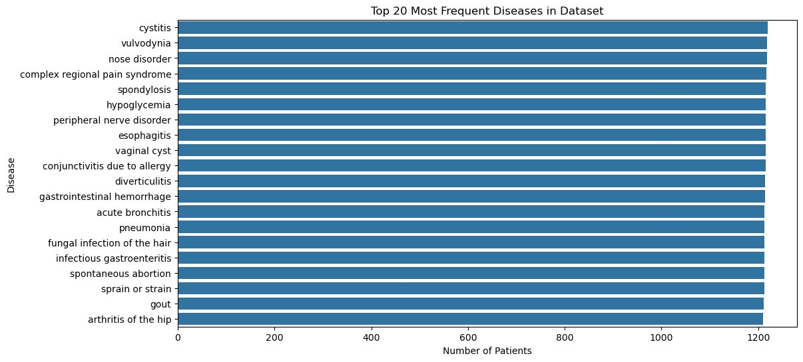
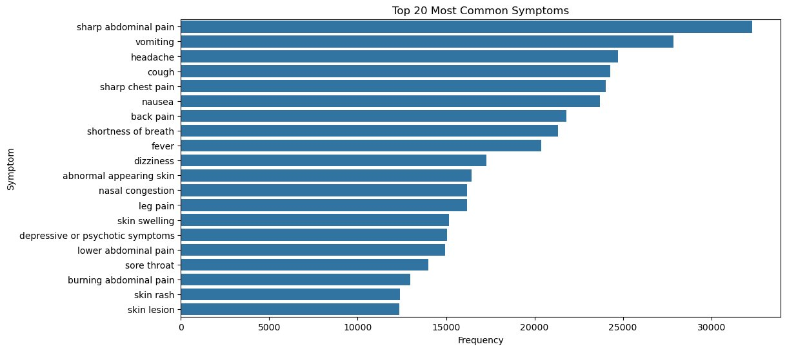
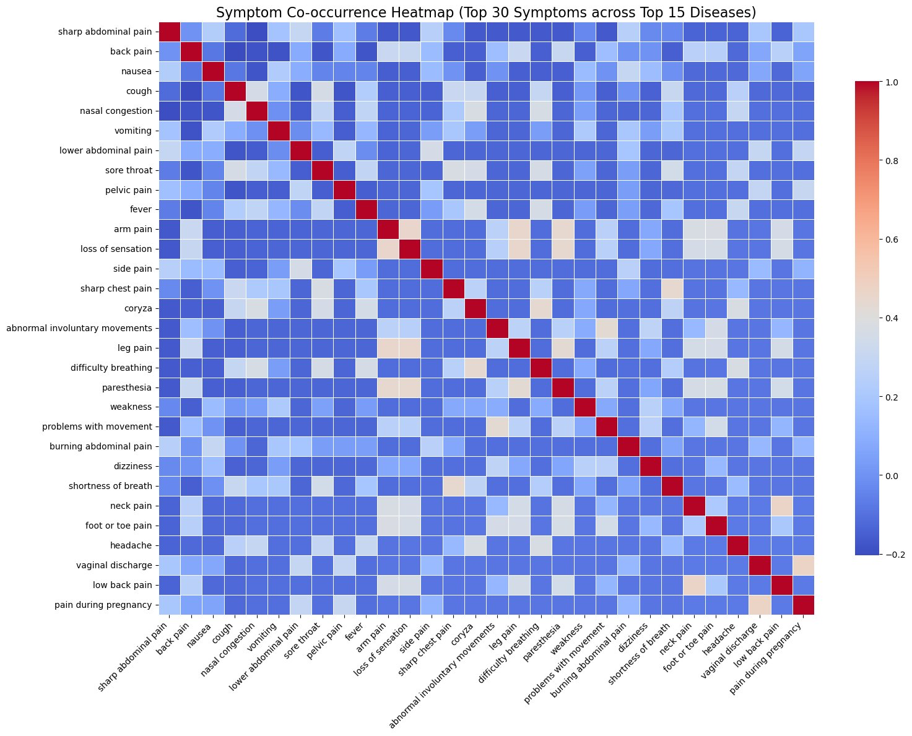
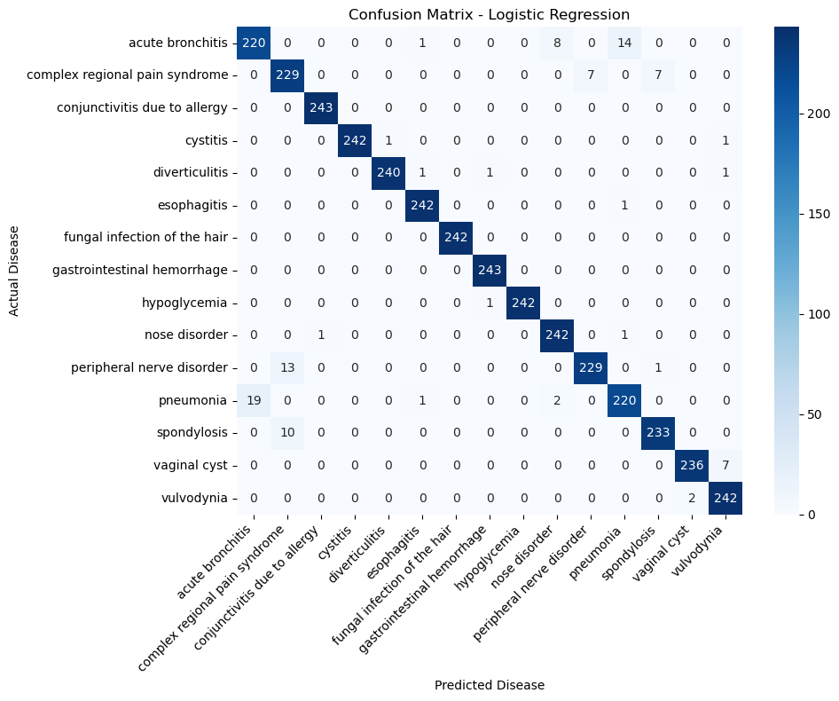
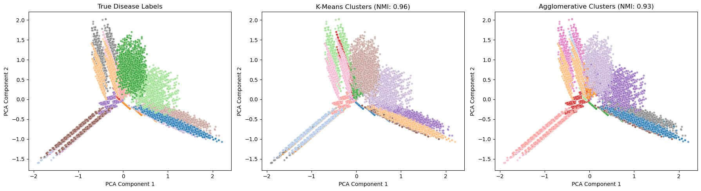

# Disease Prediction from Symptom Profiles

**A comparative study of supervised and unsupervised machine learning on 246,945 patient records.**

Matthew Setiadi · CIS 3715: Principles of Data Science · Dr. Hongchang Gao · Temple University · Spring 2026

---

## Key findings

**1. The simplest model won.** Logistic Regression matched KNN at 97.23% accuracy and beat Random Forest (96.90%). The highest-capacity model performed slightly worse, which suggests decision boundaries in this 101-dimensional symptom space are close to linear. Adding model complexity did not buy accuracy here.

**2. Clustering recovered the disease structure without labels.** K-Means reached NMI 0.9632 against the true labels, meaning roughly 96% of the grouping structure was recoverable from symptom co-occurrence alone.

**3. The remaining error is a data limitation, not a tuning problem.** Every model failed on the same two pairs: acute bronchitis with pneumonia, and complex regional pain syndrome with peripheral nerve disorder. These are clinically similar conditions with overlapping symptom profiles. No amount of hyperparameter tuning separates classes that are not separable in the available feature space. Fixing this requires more features, not a better model.

---

## Dataset

[Kaggle Disease-Symptom Dataset](https://www.kaggle.com/datasets/itachi9604/disease-symptom-description-dataset) (`Final_Augmented_dataset_Diseases_and_Symptoms.csv`)

| | |
|---|---|
| Patient records | 246,945 |
| Symptom features | 377 (binary, one-hot encoded) |
| Disease classes | 773 |
| Missing values | 0 |



**Why I reduced 773 classes to 15.** The class distribution is severely long-tailed. Most of the 773 diseases appear too few times to train or evaluate on honestly, and reporting accuracy across classes with a handful of examples each would produce a number that looks impressive and means nothing. I restricted the problem to the 15 most frequent diseases (18,228 rows), where every class has enough support for a meaningful train/test split. This is a deliberate scope reduction, not a filter for easy cases.





---

## Preprocessing

| Step | Detail | Result |
|---|---|---|
| Class selection | Top 15 most frequent diseases | 18,228 rows |
| Zero-variance removal | Dropped 276 constant columns | 101 informative features |
| Normalization | Min-Max scaling to [0, 1] | — |
| Train/test split | 80/20, **stratified** | 14,582 train / 3,646 test |

Stratification matters here because the 15 retained classes are still imbalanced. A random split risks under-representing the smaller classes in the test set, which would make the reported accuracy depend on the split rather than the model.

---

## Results

### Supervised

| Model | Accuracy | Macro F1 |
|---|---|---|
| Logistic Regression | **97.23%** | 0.97 |
| KNN (k=15, chosen by 5-fold CV) | **97.23%** | 0.97 |
| Random Forest (100 trees) | 96.90% | 0.97 |

k was selected by 5-fold cross-validation across seven candidate values rather than picked by hand.



The confusion matrices show the same failure mode across all three classifiers, which is what led to the conclusion in Key Finding 3. A single model failing on a class pair suggests a model problem. All three failing on the same pair suggests the classes are not distinguishable from these features.

### Unsupervised

PCA at 30 components, then clustering with k=15.

| Method | NMI |
|---|---|
| K-Means | **0.9632** |
| Agglomerative (Ward) | 0.9316 |



---

## Limitations

- **Binary symptoms only.** The dataset records symptom presence or absence, with no severity, duration, or onset ordering. Those are exactly the signals a clinician would use to separate bronchitis from pneumonia, and their absence is the likely cause of the residual error.
- **Scoped to 15 of 773 classes.** The reported accuracy describes this 15-class problem. It should not be read as performance on the full disease space, which would be substantially harder.
- **Augmented data.** The source is described as augmented, so the record count overstates the number of genuinely independent observations. Real-world performance would likely be lower.
- **No clinical validation.** This is a coursework study of a modeling question, not a diagnostic tool.

## What I would do differently

- Test whether the two confused pairs separate with additional features (severity scales, symptom duration) before spending any further effort on model selection.
- Report per-class precision and recall for the confused pairs specifically, rather than relying on macro F1, which averages the failure away.
- Evaluate on a held-out disease set to test whether the clustering structure generalizes beyond the 15 classes it was fit on.

---

## Repository

```
FinalProj3715.ipynb     Main notebook (all code)
FinalProj3715.tex       LaTeX export
FinalProj3715.html      HTML export
/figures                Generated plots
/reports                Proposal, progress reports, final report, lightning talk
```

## Running it

```bash
pip install pandas numpy scikit-learn matplotlib seaborn
jupyter notebook FinalProj3715.ipynb
```

Place `Final_Augmented_dataset_Diseases_and_Symptoms.csv` in the same directory before running.

**Requirements:** Python 3.x · pandas · numpy · scikit-learn · matplotlib · seaborn

---

## References

- Breiman, L. (2001). Random forests. *Machine Learning, 45*(1), 5–32.
- Guo, G., Wang, H., Bell, D., Bi, Y., & Greer, K. (2003). KNN model-based approach in classification. In *Proceedings of OTM Confederated International Conferences.*
- Xu, R., & Wunsch, D. (2005). Survey of clustering algorithms. *IEEE Transactions on Neural Networks, 16*(3), 645–678.

Dataset by [itachi9604](https://www.kaggle.com/datasets/itachi9604/disease-symptom-description-dataset) on Kaggle.
